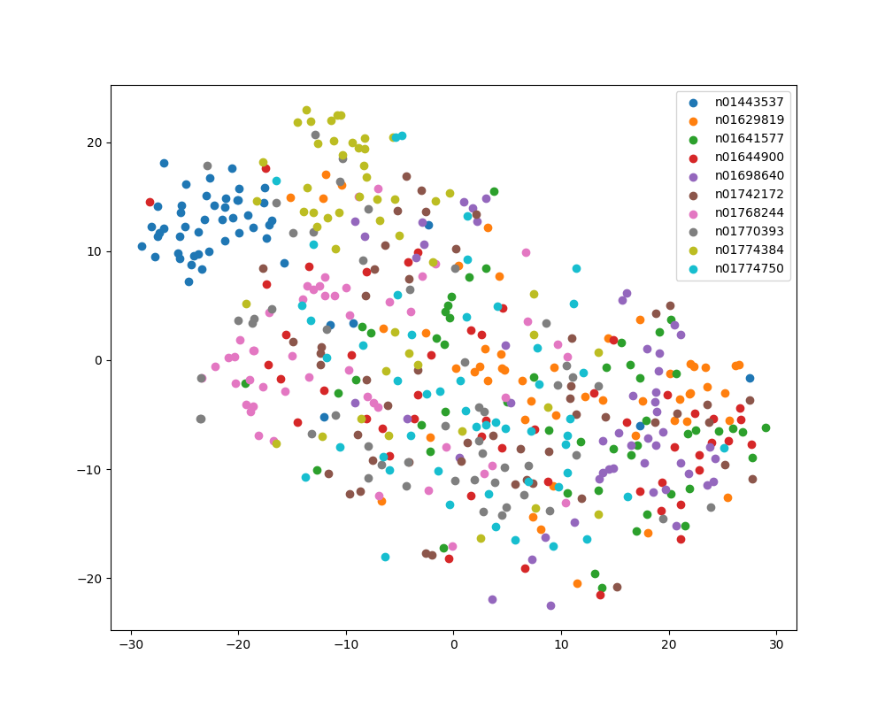
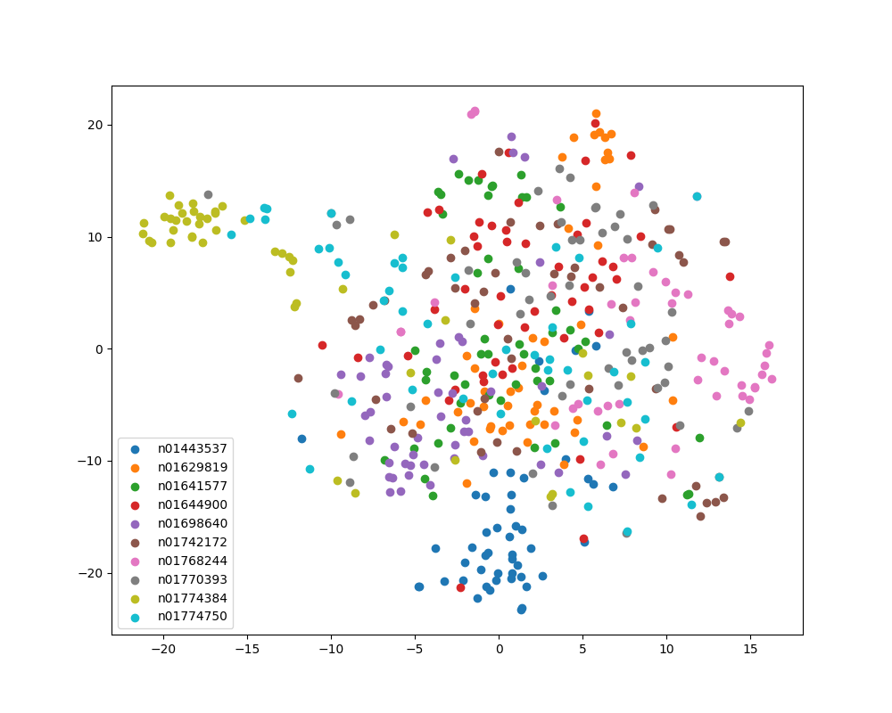
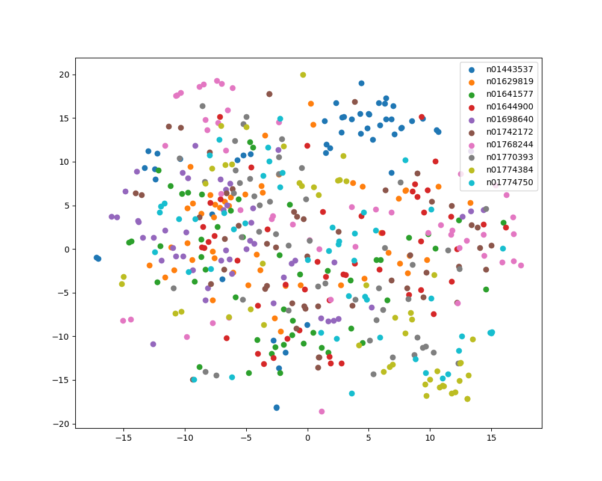
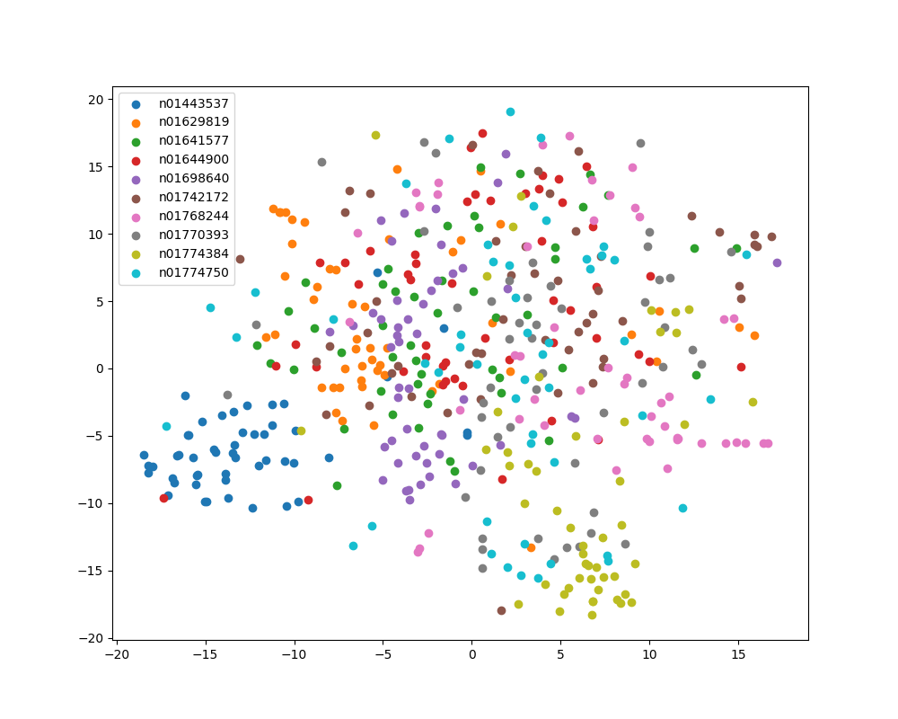
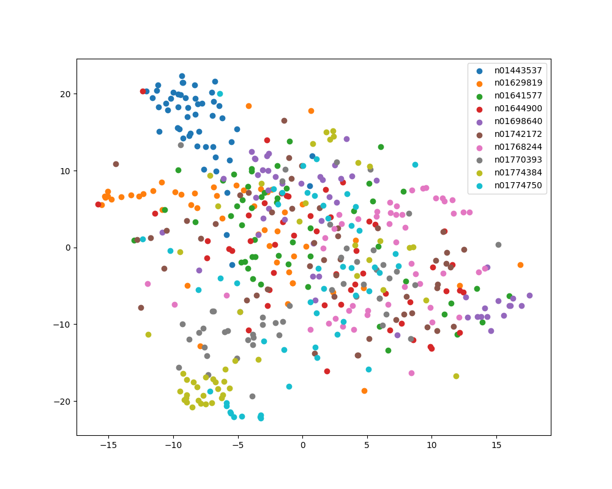
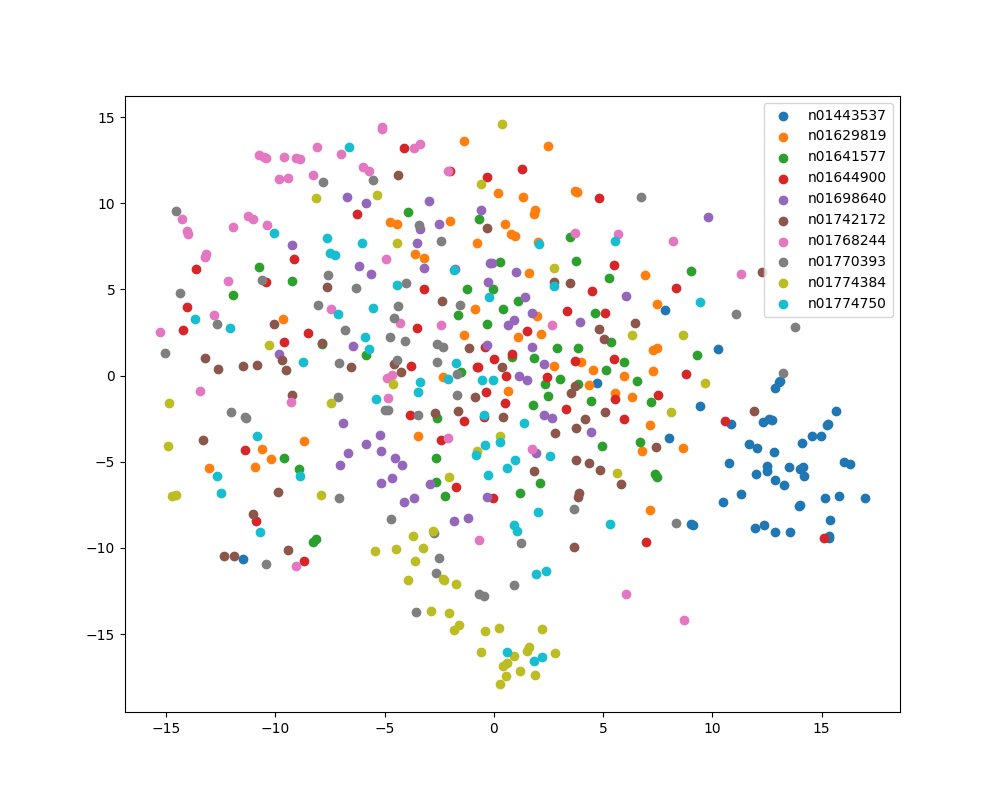
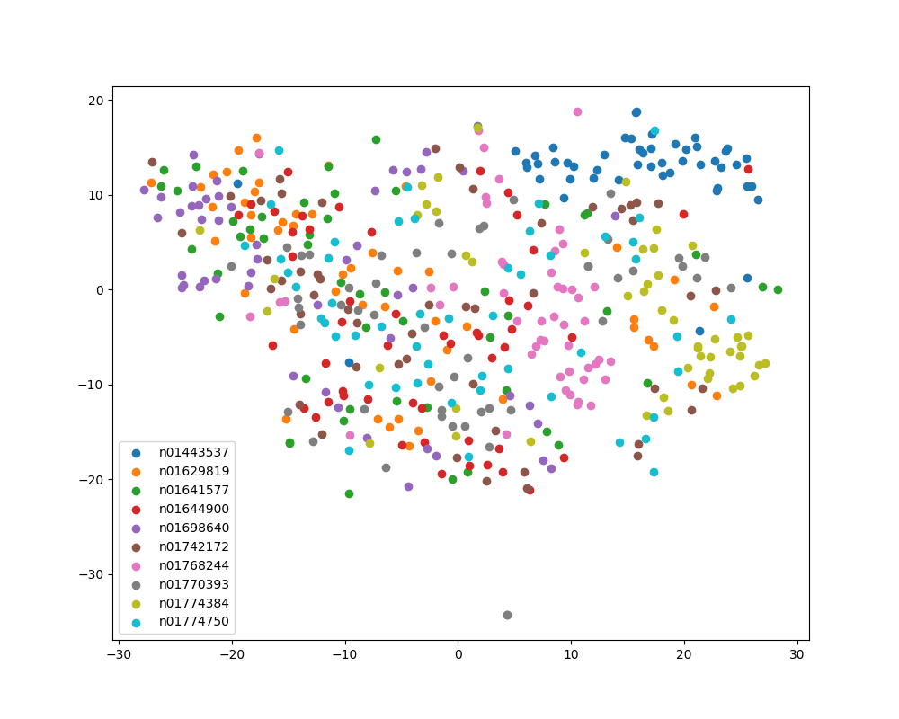

Testing pretrained model on Tiny ImageNet dataset for classification and retrieval tasks
===

Here is the t-SNE plot of embeddings of Tiny ImageNet validation dataset of 10 classes using different pretrained models.

### AlexNet

### DenseNet

### MNASNet

### MobileNet

### ResNet-18

### ResNet-101

### ShuffleNet

### SqueezeNet

### VGG-19

As can be seen, mostly classes are decently well-separated.
