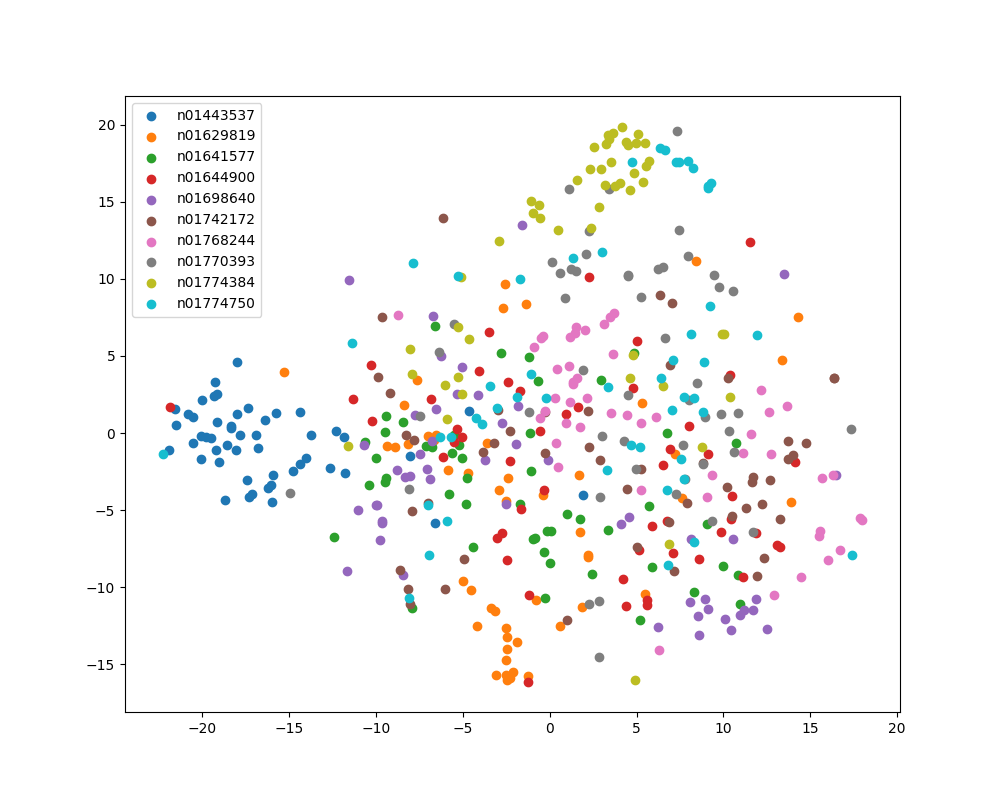

Testing pretrained model on Tiny ImageNet dataset for classification and retrieval tasks
===

Here is the t-SNE plot of embeddings of Tiny ImageNet validation dataset of 10 classes using a pretrained ResNet-101 model.

As can be seen, mostly classes are decently well-separated.
